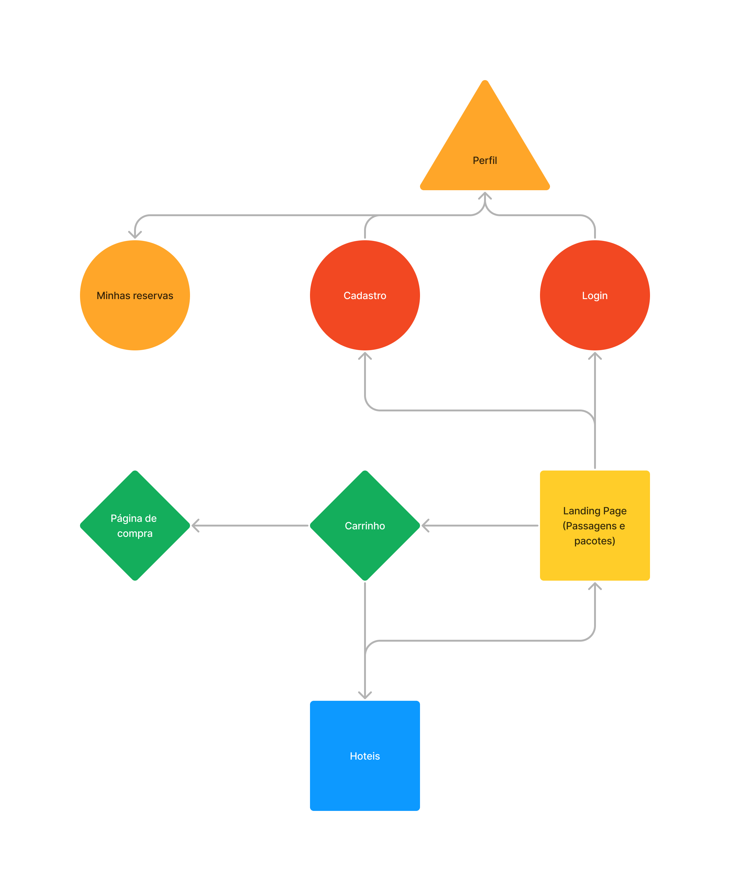

# Introducao-Web-2023.2
Trabalho de Introdução ao Desenvolvimento Web - SCC0219 (2023.2)

---

| Nome | NUSP |
| ---- | ---- |
| Jean Michel Furtado M'Peko | 5271916 |
| Vítor Augusto Paiva de Brito | 13732303 |
|  |  |

---

## Requirements
### Usuários
* Clientes
  * Capazes de comprar passagens aéreas e hospedagens em hotéis na cidade de destino.
* Administradores
  * Capazes de gerenciar outros administradores, clientes e ofertas.
### Compra de produtos/serviços
* Clientes podem adicionar passagens e hospedagens a um carrinho. Após isso, devem poder finalizar a compra utilizando um cartão de crédito.
### Gerenciamento de produtos/serviços
* Administradores devem poder fazer operações de CRUD sobre todas as ofertas disponibilizadas no site.
### Usabilidade
* O sistema deve ser de fácil uso, sendo altamente acessível.
* O sistema deve ser responsivo, de modo que as operações sejam realizadas em tempo hábil.
## Project Description
### Funcionalidades
* Gerenciamento de conta.
* Compra de passagens aéreas.
* Compra de hospedagens em hotéis.
* Acompanhamento de reservas.

### Navegação
* Os protótipos de tela no [figma](https://www.figma.com/file/pUHEav14fR9GSXJ9Gk1iWq/Web-Milestone1?type=design&node-id=0%3A1&mode=design&t=Lli3eqv7sJLlKVP3-1), bem como a navegação mostrada no vídeo abaixo, ilustram a interação entre as telas de modo a cumprir os requisitos propostos no tópico acima.

https://github.com/vtpaiva/Introducao-Web-2023.2/assets/101905045/e7e831d6-fcc7-4163-8b87-fe4c9e452825

* Essa interação pode também ser descrita a partir do diagrama abaixo.

* Além do uso da ferramenta figma, alguns mockups foram implementadas em HTML e CSS ([Landing Page](landingPage.html), [Login](signin.html), [Cadastro](signup.html), [Pagamento](buyPage.html)).

### Informações salvas no servidor
#### Administradores
* Nome.
* Id.
* Telefone.
* E-mail.
#### Cliente
* Nome.
* Id.
* Foto.
* Endereço.
* Telefone.
* E-mail.
#### Voos
* Cidade de origem.
* Cidade de destino.
* Data e horário de saída.
* Data e horário previsto de chegada.
* Quantidade de assentos disponíveis.
* Preço.
* Quantidade vendida.
#### Hotéis
* Cidade.
* Foto.
* Descrição.
* Disponibilidade em dado momento de check-in.
* Preço.
* Quantidade vendida.

## Comments About the Code
## Test Plan
## Test Results
## Build Procedures
## Problems
## Comments
