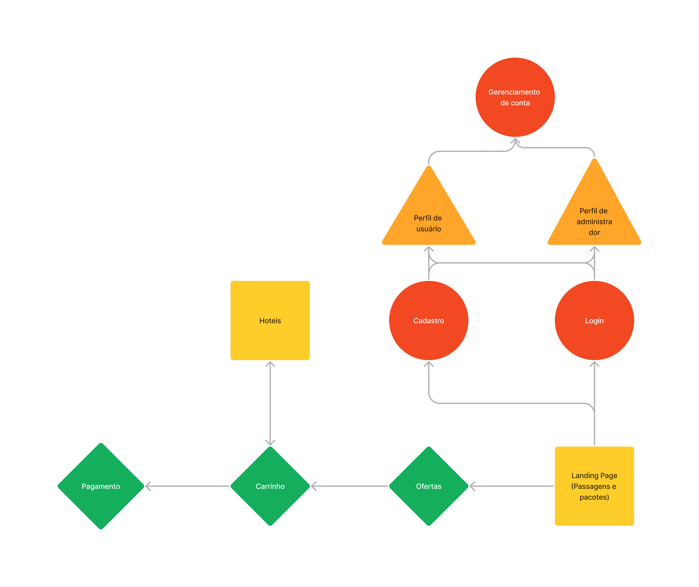

# web-development
---

| Name | NUSP |
| ---- | ---- |
| Jean Michel Furtado M'Peko | 5271916 |
| Vítor Augusto Paiva de Brito | 13732303 |
| Gabriel Cazzini Cardoso | 12547771 |

---

## Requirements
### Users
* Clients
  * Able to purchase airline tickets and hotel accommodations in the destination city.
* Administrators
  * Able to manage other administrators, clients, and offers.

### Product/Service Purchases
* Clients can add flights and accommodations to a shopping cart. After that, they should be able to complete the purchase using a credit card.

### Product/Service Management
* Administrators should be able to perform CRUD operations on all offers available on the website.

### Usability
* The system should be easy to use and highly accessible.
* The system must be responsive, ensuring timely operations.

## Project Description
### Features
* Account management.
* Airline ticket purchasing.
* Hotel accommodation purchasing.
* Reservation tracking.

#### Additional Feature
* Based on the flight destination cities, the system should offer accommodations in hotels in the same location. This way, the customer can easily integrate both purchases without needing to go to competitors, increasing our competitiveness in the market.

### Navigation
* The screen prototypes on [Figma](https://www.figma.com/file/pUHEav14fR9GSXJ9Gk1iWq/Web-Milestone1?type=design&node-id=0%3A1&mode=design&t=Lli3eqv7sJLlKVP3-1), as well as the navigation shown in the video below, illustrate the interaction between screens to meet the requirements proposed above.

https://github.com/vtpaiva/Introducao-Web-2023.2/assets/101905045/e7e831d6-fcc7-4163-8b87-fe4c9e452825

* This interaction can also be described by the diagram below.  

* Besides using Figma, some mockups were implemented in HTML and CSS ([Landing Page](landingPage.html), [Login](signin.html), [Signup](signup.html), [Payment](buyPage.html)).

### Information Saved on the Server
#### Administrators
* Name.
* ID.
* Phone.
* Email.

#### Clients
* Name.
* ID.
* Photo.
* Address.
* Phone.
* Email.

#### Flights
* Departure city.
* Destination city.
* Departure date and time.
* Expected arrival date and time.
* Available seat count.
* Price.
* Tickets sold.

#### Hotels
* City.
* Photo.
* Description.
* Availability at the given check-in moment.
* Price.
* Bookings made.

## Comments About the Code
The main languages and tools used in the development were: HTML; CSS; JavaScript; React; react-router-dom (routing); axios (requests); express (server); MongoDB and mongoose (database)

## Test Plan
* Server tests were performed using Insomnia.
   * Example: 

* Interface tests were performed manually.

## Test Results
* Functional.
* Test users:
    * Administrators:
        * Email: admin1@example.com
        * Password: senhateste
        * Email: admin2@example.com
        * Password: admin2password
        * Email: admin3@example.com
        * Password: admin3password
    * Clients:
        * Email: user1@example.com
        * Password: password1
        * Email: user2@example.com
        * Password: password2

## Build Procedures
### Import node modules
Import the "node_modules" folder from a project created with create-react-app.

### Install modules
Inside the directory of this folder in the terminal, run the command `npm install`.

### Run the project
Finally, in a different terminal, still in the folder, run the command `npm start`.

## Problems
No issues found.

## Comments
No comments.
